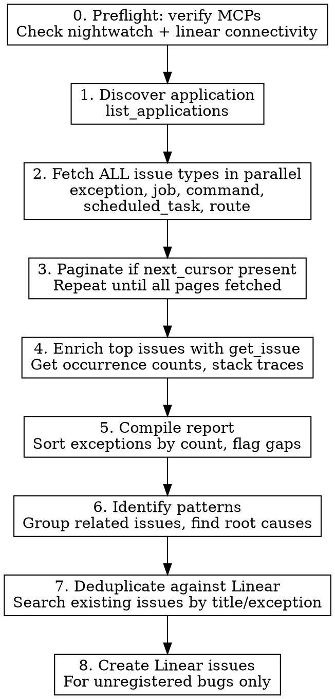

# Nightwatch Health Audit

## Overview

Systematically pull all issue categories from Laravel Nightwatch MCP, enrich with occurrence counts, compile into a prioritized bug report, and **create Linear issues for any bugs not already tracked**. The goal is a single document that gives a complete picture of application health with all bugs flowing into Linear for tracking.

## When to Use

- User asks to check application health or generate a bug report
- User wants to know what's broken or needs attention
- User says "check nightwatch", "audit errors", "what are the problems"
- After connecting Nightwatch MCP (`/mcp` -> nightwatch)

## Workflow



## Step-by-Step

### 0. Preflight: Verify MCP Connectivity

**This step is mandatory. Do NOT skip it.** Before any audit work, verify that both required MCP servers are connected and responding.

#### Check both MCPs in parallel:

```
mcp__nightwatch__list_applications()   # Tests Nightwatch connectivity
mcp__linear__list_issues(query: "test") # Tests Linear connectivity (any lightweight call)
```

Fire both calls simultaneously. Then evaluate the results:

#### Decision matrix:

| Nightwatch | Linear | Action |
|------------|--------|--------|
| OK | OK | Proceed to Step 1 |
| OK | FAILED | Proceed with audit (steps 1-6) but **skip Linear steps 7-8**. Warn: "Linear MCP is not connected — audit will run but issues won't be created in Linear." |
| FAILED | OK | **STOP.** Cannot audit without Nightwatch. Guide user to fix (see below). |
| FAILED | FAILED | **STOP.** Neither MCP is working. Guide user to fix both (see below). |

#### What "FAILED" means:

A call has failed if:
- The tool doesn't exist (no `mcp__nightwatch__*` or `mcp__linear__*` tools available)
- The call returns a connection error, auth error, or timeout
- The response is an HTTP 401/403 (bad credentials)

#### When Nightwatch MCP is missing or broken:

Tell the user (keep it simple — they are not technical):

> **I need to connect to Nightwatch first.** Please do this:
>
> 1. Open [nightwatch.laravel.com](https://nightwatch.laravel.com)
> 2. Go to **Settings → MCP**
> 3. Copy your **API token** and paste it here
>
> I'll handle the rest!

Once the user provides the token, **you configure everything automatically:**

1. Use the `update-config` skill (or directly write to `.claude/settings.json`) to add the Nightwatch MCP server config:
   ```json
   {
     "nightwatch": {
       "type": "http",
       "url": "https://nightwatch.laravel.com/api/mcp",
       "headers": {
         "Authorization": "Bearer <TOKEN_FROM_USER>"
       }
     }
   }
   ```
2. Tell the user: "All set! Please restart Claude Code (Cmd+R or close and reopen) and run this command again."

**If the token is expired or invalid (401/403):**

> Your Nightwatch token seems expired. Could you grab a fresh one?
> Go to [nightwatch.laravel.com](https://nightwatch.laravel.com) → **Settings → MCP** → copy the token and paste it here.

#### When Linear MCP is missing or broken:

Tell the user:

> **I also need Linear connected to create bug tickets.** This one's easy — no token needed.
> Please restart Claude Code after I set it up. Linear will ask you to log in once.

Then **configure it automatically:**

1. Add the Linear MCP server config:
   ```json
   {
     "linear": {
       "type": "http",
       "url": "https://mcp.linear.app/mcp"
     }
   }
   ```
2. Tell the user to restart Claude Code. Linear uses OAuth — it will prompt them to log in on first use.

**If Linear returns an auth error:** Tell the user "Linear needs you to log in again. Please restart Claude Code — it will show a login prompt."

**Only proceed to Step 1 once Nightwatch is confirmed working.**

---

### 1. Discover the Application

```
mcp__nightwatch__list_applications  # optionally with query filter
```

If multiple apps match, ask the user which one. Remember `application_id` for the session.

### 2. Fetch All Issue Types in Parallel

Fire ALL of these simultaneously - they are independent:

```
mcp__nightwatch__list_issues(application_id, type: "exception")
mcp__nightwatch__list_issues(application_id, type: "job")
mcp__nightwatch__list_issues(application_id, type: "command")
mcp__nightwatch__list_issues(application_id, type: "scheduled_task")
mcp__nightwatch__list_issues(application_id, type: "route")
```

**Key:** Use parallel tool calls. This is 5 independent requests - never run them sequentially.

### 3. Paginate Through All Results

If any response includes `next_cursor`, fetch the next page. Exceptions often have 25+ issues across multiple pages. Don't stop at the first page.

### 4. Enrich Key Issues

Call `mcp__nightwatch__get_issue` on the most important issues (batch in parallel, up to ~15 at a time):

- **All recent issues** (last 24-48 hours) - they're actively happening
- **Issues that appear to recur** (seen across a date range)
- **Issues in different categories** (get a representative sample)

What you're looking for from `get_issue`:
- **Occurrence counts** (last 24h, 7d, 30d) - this is the priority signal
- **Stack traces** - to understand root cause and group related issues
- **Code context** - to write actionable descriptions
- **Deploy info** - which environment is affected
- **Nightwatch URL** - to link from Linear issues

### 5. Compile the Report

Structure the output with these sections:

#### Exceptions (sorted by 30-day count descending)

| # | Ref | Exception | Count (30d) | Count (7d) | Last Seen | Location | Linear |
|---|-----|-----------|-------------|------------|-----------|----------|--------|

This is the most important section. Sort by count - highest first.

#### Failed Jobs

If no job issues found, explicitly state "No failed/slow jobs detected" BUT cross-reference with exceptions - jobs may be failing silently if exceptions are caught inside job handlers.

#### Failed Commands

List command-related exceptions separately. Include the command name, arguments, and error.

#### Scheduled Tasks

Report status. No issues = good news worth stating explicitly.

#### Outgoing Request Problems

Filter for HTTP client exceptions, timeouts, connection errors. These indicate external service issues.

### 6. Identify Patterns

After listing individual issues, add a "Key Patterns & Recommendations" section:

- **Group related issues** - e.g., 15 "undefined column" errors may all stem from one incomplete migration
- **Flag silent failures** - jobs that catch exceptions internally but still fail
- **Highlight severity** - Critical (data loss, broken core features) vs Medium (degraded UX) vs Low (transient/cosmetic)
- **Note environment** - staging-only vs production issues

### 7. Deduplicate Against Linear

Before creating any Linear issues, search for existing ones to avoid duplicates.

For each Nightwatch issue worth tracking, search Linear:

```
mcp__linear__list_issues(team: "<team>", query: "<exception class or issue title>")
```

**Matching strategy:**
- Search by the exception class name (e.g. `QueryException`, `ModelNotFoundException`)
- Also search by a distinctive fragment of the error message
- If an existing Linear issue's title contains the same exception class AND similar location, consider it a match
- When in doubt, it's better to skip creation than create a duplicate

**Run searches in parallel** - batch up to 10 at a time.

Compile two lists:
- **Already tracked:** Nightwatch issues that have a matching Linear issue (note the Linear identifier)
- **Unregistered:** Nightwatch issues with no matching Linear issue

### 8. Create Linear Issues for Unregistered Bugs

For each unregistered bug, create a Linear issue using `mcp__linear__save_issue`.

**Priority mapping:**
| Nightwatch Signal | Linear Priority |
|-------------------|-----------------|
| Critical: data loss, auth broken, payments failing | 1 (Urgent) |
| High: 100+ occurrences/30d, core feature broken | 2 (High) |
| Medium: 10-100 occurrences/30d, degraded UX | 3 (Normal) |
| Low: <10 occurrences/30d, cosmetic, transient | 4 (Low) |

**Issue creation parameters:**

```
mcp__linear__save_issue(
  team: "<team name>",
  title: "[NW-<ref>] <ExceptionClass> in <Location>",
  description: <see template below>,
  priority: <mapped priority>,
  labels: ["bug", "nightwatch"]
)
```

**Create issues in parallel** - batch up to 5 at a time.

#### Linear Issue Description Template

```markdown
## Bug Report (from Nightwatch)

**Exception:** `<Full\Exception\Class\Name>`
**Location:** `<file>:<line>` in `<method>()`
**Environment:** <production/staging>
**First seen:** <date>
**Last seen:** <date>

---

## Occurrence Stats

| Period | Count |
|--------|-------|
| Last 24h | <n> |
| Last 7d | <n> |
| Last 30d | <n> |

## Error Message

```
<The actual error message text>
```

## Stack Trace (top frames)

```
<Top 5-8 frames of the stack trace>
```

## Code Context

<If available from get_issue, include the code snippet around the error line>

## Reproduction Context

- **Route/Job/Command:** <what triggered it>
- **HTTP Method & URL:** <if route-related>
- **User context:** <if available>

## Related Issues

<List any Nightwatch issues that share the same root cause or pattern>

---

> Auto-generated from [Nightwatch #<ref>](<nightwatch_url>)
```

**Key rules for descriptions:**
- Always include the Nightwatch link at the bottom
- Always include occurrence stats - this is how engineers prioritize
- Include the actual error message verbatim, not paraphrased
- Stack trace should show the top frames (app code, not framework boilerplate)
- If multiple Nightwatch issues share a root cause, mention them all in one Linear issue

## Common Mistakes

- **Skipping the preflight check** - ALWAYS verify MCP connectivity before doing any work. Failing mid-audit because Nightwatch isn't connected wastes time and confuses the user
- **Proceeding after MCP failure** - If Nightwatch MCP fails, STOP and guide the user. Don't try to work around it
- **Stopping at page 1** - Always check for `next_cursor` and paginate
- **Not fetching details** - The list only shows titles; `get_issue` gives counts and stack traces needed for prioritization
- **Sequential API calls** - All issue type fetches and detail fetches should be parallel
- **Ignoring "no issues" categories** - Explicitly report clean categories; "no failed jobs" is valuable information
- **Listing without analysis** - Raw lists aren't actionable. Group related issues and identify root causes
- **Missing cross-references** - An exception in a job handler means the job is broken even if Nightwatch shows zero job issues
- **Creating duplicate Linear issues** - Always search Linear first. Match on exception class + location
- **Vague Linear descriptions** - Every Linear issue must have occurrence stats, error message, stack trace, and Nightwatch link
- **Creating one Linear issue per Nightwatch issue blindly** - Group related issues that share a root cause into a single Linear issue
- **Skipping the "bug" label** - Always apply the "bug" label so issues are filterable
